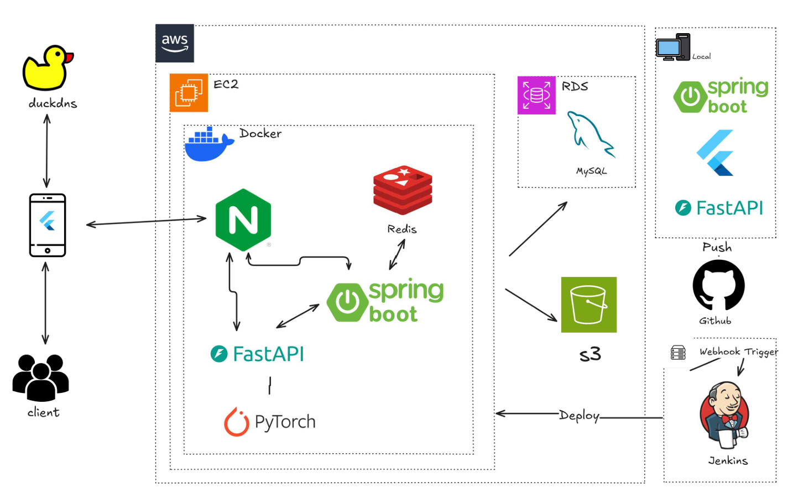

# 중고 의류 거래 플랫폼
인하대학교 학생들을 위한 중고 의류 경매 플랫폼입니다.

## 주요 기능

- **인하대학교 학생 전용 로그인**: `@inha.edu` 또는 `@inha.ac.kr` 이메일을 통한 Google OAuth2 인증
- **의류 경매 시스템**: 중고 의류를 등록하고, 실시간으로 입찰 및 낙찰받을 수 있는 경매 기능
- **AI 스타일 분석 및 추천**: 사용자가 자신의 옷 사진을 업로드하면 AI가 스타일을 분석하고, 취향에 맞는 경매 상품을 추천
- **실시간 채팅**: 상품 낙찰 후 판매자와 구매자 간의 원활한 소통을 위한 실시간 채팅 기능

## 기술 스택

- **Backend**: Java, Spring Boot, MySQL, Redis
- **Frontend**: Flutter, Dart
- **AI**: Python, PyTorch, FastAPI
- **Infra**: AWS EC2, RDS, S3, Docker, Nginx, Jenkins

## 시스템 구조

